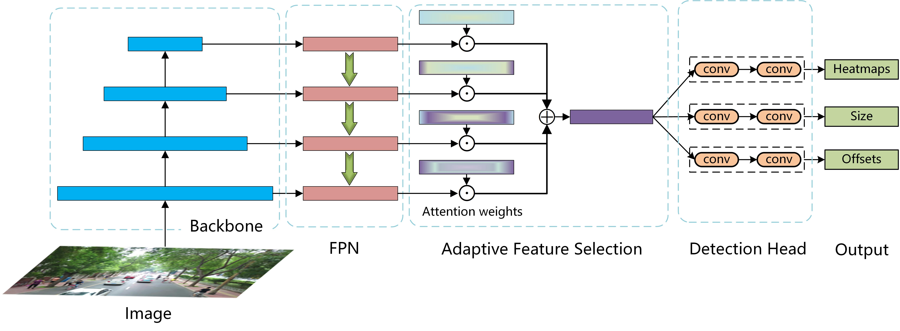
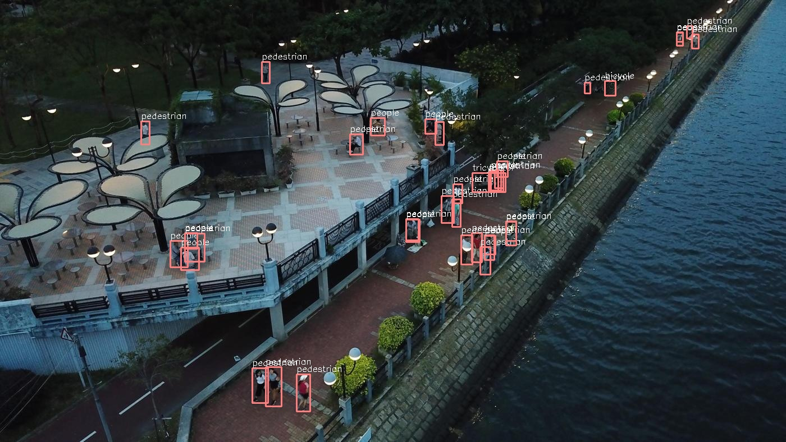
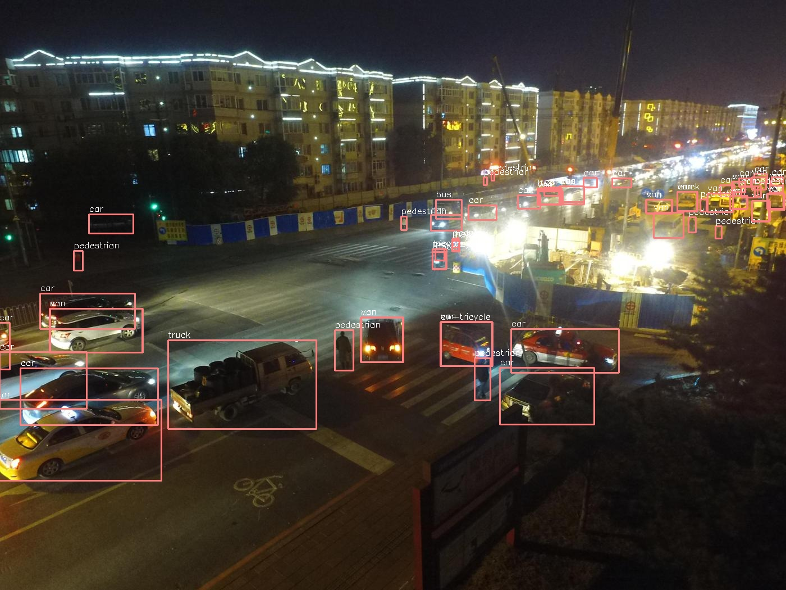

# Towards Better Object Detection in Scale Variation with Adaptive Feature Selection 

This repository is the official implementation of [Towards Better Object Detection in Scale Variation with Adaptive Feature Selection ](), which is based on [PaddleDetection](https://github.com/PaddlePaddle/PaddleDetection).



## Requirements
- Linux (Windows is not officially supported)
- Python 3.6 or higher
- PaddlePaddle 1.8.0 or higher
- CUDA 9.0+
- cuDNN 7.6+
- GCC 4.9+
- [mmcv](https://github.com/open-mmlab/mmcv)

## Installation
a. Create a conda virtual environment and activate it.

```shell
conda create -n afsm_detection python=3.6 -y
source activate afsm_detection
```

b. Install PaddlePaddle following the [official instructions](https://www.paddlepaddle.org.cn/install/quick/zh/1.8.5-linux-pip).

e.g.
```shell
python -m pip install paddlepaddle-gpu==1.8.5.post97 -i https://mirror.baidu.com/pypi/simple
```

c. Clone our code

```shell
git clone https://github.com/ZeHuiGong/AFSM.git
cd AFSM_Detection
```
d. install requirements and compile

```shell
pip install mmcv==0.2.8
pip install pycocotools
pip install -r requirements.txt
```

e. Run the following command to test the installation is correct.

```shell
python ppdet/modeling/tests/test_architectures.py
```

f. After the test is passed, the following information will be prompted:

```shell
..........
----------------------------------------------------------------------
Ran 12 tests in 2.480s
OK (skipped=2)
```

## Prepare datasets

It is recommended to symlink the dataset root to ```AFSM_Detection/dataset```. Our directory structure is as follows:

```
AFSM_Detection
├── configs
├── ppdet
├── dataset
│   ├── voc
│   │   ├── test.txt
│   │   ├── trainval.txt
│   │   ├── label_list.txt
│   │   ├── VOCdevkit
│   │   │   ├──VOC2007     
│   │   │   ├──VOC2012
│   ├── visdrone
│   │   ├── val2019
│   │   ├── train2019
│   │   ├── test_dev2019
│   │   ├── test_challenge2019
│   │   ├── annotations
```

- VisDrone (one of the following two methods): 

1. You can go to the [official website](http://aiskyeye.com/login/?redirect_to=http%3A%2F%2Faiskyeye.com%2Fdownload%2Fobject-detection%2F) to download the dataset and annotations (need to register), and transfer the annotation from ```.txt``` to coco ```.json``` format using the following command:

```shell
python ppdet/data/tools/visDrone/visdrone2019.py
```

2. Or download our processed version from [BaiduAI](https://aistudio.baidu.com/aistudio/datasetdetail/8923).

Once downloaded, creat symlinks as the data structure mentioned above. e.g.,

```shell
ln -s $Download_Path/annotations AFSM_Detection/dataset/visdrone/
ln -s $Download_Path/VisDrone2019-DET-train/images AFSM_Detection/dataset/visdrone/train2019
ln -s $Download_Path/VisDrone2019-DET-val/images AFSM_Detection/dataset/visdrone/val2019
ln -s $Download_Path/VisDrone2019-DET-test-dev/images AFSM_Detection/dataset/visdrone/test_dev2019
ln -s $Download_Path/VisDrone2019-DET-test-challenge/images AFSM_Detection/dataset/visdrone/test_challenge2019
```

where ```$Download_Path``` implies the path you download on the disk.

- PASCAL-VOC

Run the following command to download the VOC dataset.

```shell
python dataset/voc/download_voc.py
```

Once done, the data stucture will be the same as mentioned above.

Using symlinks is a good idea because you will likely want to share the same dataset installation between multiple projects.

## Train a model

- VOC

To train a model on the union set of VOC 2007 and 2012 train&val, we provide demo congif files in ```AFSM_Detection/configs/anchor_free/centernet/voc_exps/```, simply run

```train
python tools/train.py \
-c configs/anchor_free/centernet/voc_exps/r101_vd_fpn_dcn_AFSM_GcbMixupCasmGIOU.yml \
-o use_gpu=true
```

- VisDrone

For the VisDrone-DET 2019 dataset, the demo config files to reproduce the main results in the paper is given in ```AFSM_Detection/configs/anchor_free/centernet/visdrone_exps/```.

e.g., simply run:
```train
python tools/train.py \
-c configs/anchor_free/centernet/visdrone_exps/cbr50_fpn_dcn_AFSM_GcbMixupCasmGIOU.yml \
-o use_gpu=true
```
 Feel free to change the config file, if you want to train on other settings, e.g., various backbone network. Besides, ```batch_size``` can be set adaptively according to your GPU memory, in the corresponding config file.

## Evaluation

Once you have trained the network, run the following command to evaluate the performance of the trained model. For example, you want to evaluate the performance trained with Resnet101 backbone, on the VOC dataset, simply run:

```eval
CUDA_VISIBLE_DEVICES=0 
python tools/eval.py \
-c configs/anchor_free/centernet/voc_exps/r101_vd_fpn_dcn_AFSM_GcbMixupCasmGIOU.yml \
-o use_gpu=true \
weights=output/r101_vd_fpn_dcn_AFSM_GcbMixupCasmGIOU/model_final \
--test_scales 1.0
```

For testing on the VisDrone-DET validation dataset, simply run:
```eval
python tools/eval.py \
-c configs/anchor_free/centernet/visdrone_exps/cbr50_fpn_dcn_AFSM_GcbMixupCasmGIOU.yml \
-o use_gpu=true \
weights=output/cbr50_fpn_dcn_AFSM_GcbMixupCasmGIOU/model_final \
--test_scales 1.0
```

Feel free to change the trained wieght with different checkpoint, by setting the ```weights``` parameter.

## Results

Thanks to the novel designs proposed in our [paper](), i.e., adaptive feture selection module (AFSM) and class-aware sampling mechanism (CASM), we uplift the strong baseline
to a new state-of-the-art performance, with tiny inference overhead.

- VisDrone

The comparison results with other state-of-the-art methods on the VisDrone-DET validation subset are showed as follows:

|    Method   | Backbone | AP | AP<sup>50<sup>|AP<sup>75<sup>|
|-------------------------|:---------:|:-------:|:----------:|:-----:|
Cascade R-CNN | ResNet50       | 24.10          | 42.90          | 23.60          | 0.40          | 2.30          | 21.00          | 35.20          
Faster R-CNN  | ResNet50       | 23.50          | 43.70          | 22.20          | 0.34          | 2.20          | 18.30          | 35.70           
RetinaNet     | ResNet50       | 15.10          | 27.70          | 14.30          | 0.17          | 1.30          | 24.60          | 25.80          
FCOS          | ResNet50       | 16.60          | 28.80          | 16.70          | 0.38          | 2.20          | 24.40          | 24.40          
HFEA    | ResNeXt101     | 27.10          |  -              |        -        |               |               |                |                
HFEA   | ResNeXt152     | 30.30          |  -              |         -       |               |               |                |                
ClusDet  | ResNeXt101     | 32.40          | 56.20          | 31.60          |               |               |                |                
CPEN+FPEN    | Hourglass104   | 36.70          | 53.20          | **39.50** |               |               |                |                
DMNet+DSHNet | ResNet50       | 30.30          | 51.80          | 30.90          |               |               |                |                
DSOD      | ResNet50       | 28.80          | 47.10          | 29.30          |               |               |                |                
HRDNet     | ResNet18+101   | 28.33          | 49.25          | 28.16          | 0.47          | 3.34          | 36.91          | 36.91          
HRDNet<sup>+      | ResNeXt50+101  | 35.51          | 62.00          | 35.13          | 0.39          | 3.38          | 30.91          | 46.62          
Ours     | CBResNet50     | 33.95          | 60.46          | 32.69          | 0.66          | 7.25          | 40.28          | 49.84          
Ours<sup>+   | CBResNet50     | 37.62          | 65.41          | 37.06          | 0.62          | 7.21          | 43.21          | 56.26          
Ours     | CBResNet50+DCN | 35.43          | 61.88          | 34.60          | 0.80          | 7.77          | 41.77          | 51.48          
Ours<sup>+    | CBResNet50+DCN | **39.48** | **66.98** | 39.45          | \textbf{0.82} | \textbf{7.94} | \textbf{44.76} | \textbf{58.46} 

<sup>+ means multi-scale testing augmentation is employed

- VOC

we report the results on VOC 2007 test set, in terms of mAP (%).

|    Method   | Backbone | Input size | mAP | FPS |
|--------------------|:------:|------------------------------:|:----------:|:-----:|
|Faster R-CNN | ResNet101     | 1000x600   | 76.4           | 5     
|R-FCN     | ResNet101     | 1000x600   | 80.5           | 9      
|OHEM  | VGG-16        | 1000x600   | 74.6           | -    
|R-FCN  | ResNet101+DCN     | 1000x600   | 82.6           | -    
|CoupleNet  | ResNet101     | 1000x600   | 82.7           | 8.2   
|DeNet(wide)  | ResNet101     | 512x512    | 77.1           | 33    
|FPN-Reconfig | ResNet101     | 1000x600   | 82.4           |  -     
|Yolov2       | DarkNet19     | 544x544    | 78.6           | 40    
|SSD          | VGG-16        | 513x513    | 78.9           | 19    
|DSSD         | VGG-16        | 513x513    | 81.5           | 5.5   
|RefineDet   | VGG-16        | 512x512    | 81.8           | 24    
|CenterNet  | ResNet101     | 512x512    | 78.7           | 30    
|CenterNet   | DLA           | 512x512    | 80.7           | 33    
|HRDNet    | ResNeXt50+101 | 2000x1200  | 82.4           |  -     
|Ours         | CBResNet50    | 511x511    | 78.2           | 25.08 
|Ours     | CBResNet50+DCN    | 511x511    | 81.05          | 21.98 
|Ours     | ResNet101+DCN   | 511x511    | **83.04** | 15.96   

## Visualization

Some detection results on the Visdrone-DET validation subset are showed as follows:



## Demo
In addition, one can also infererence the pre-trained model, by given other demo images. Suppose the images are given in ```demo/```. 

e.g.,

```shell
python tools/infer.py \
-c configs/anchor_free/centernet/voc_exps/r101_vd_fpn_dcn_AFSM_GcbMixupCasmGIOU.yml \
--infer_img=demo/voc000054.jpg
```

The inference result will be stored at ```$AFSM_Detection/output```.


## Citation

If you benefit from our work in your research and product, please consider to cite the following related papers:

```shell
```